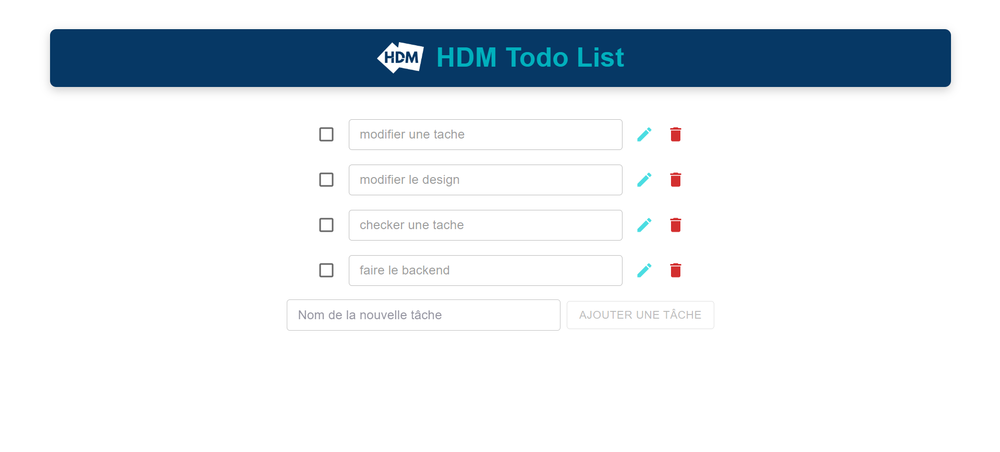

#  HDM test - ToDo List

## 📑 Main Features

- **Add a new task** 
- **Edit a task** 
- **Delete a task** 
- **Cross out a completed task** 

## 🚀 Technologies Used: 
- **Frontend: typescripts, ReactJs**
- **Backend: NestJS, TypeScript, Prisma, MySQL**

<table>
    <tr>
        <td></td>
        
    </tr>
   
        
</table>
